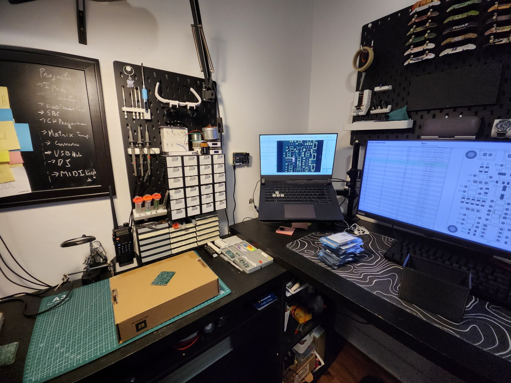
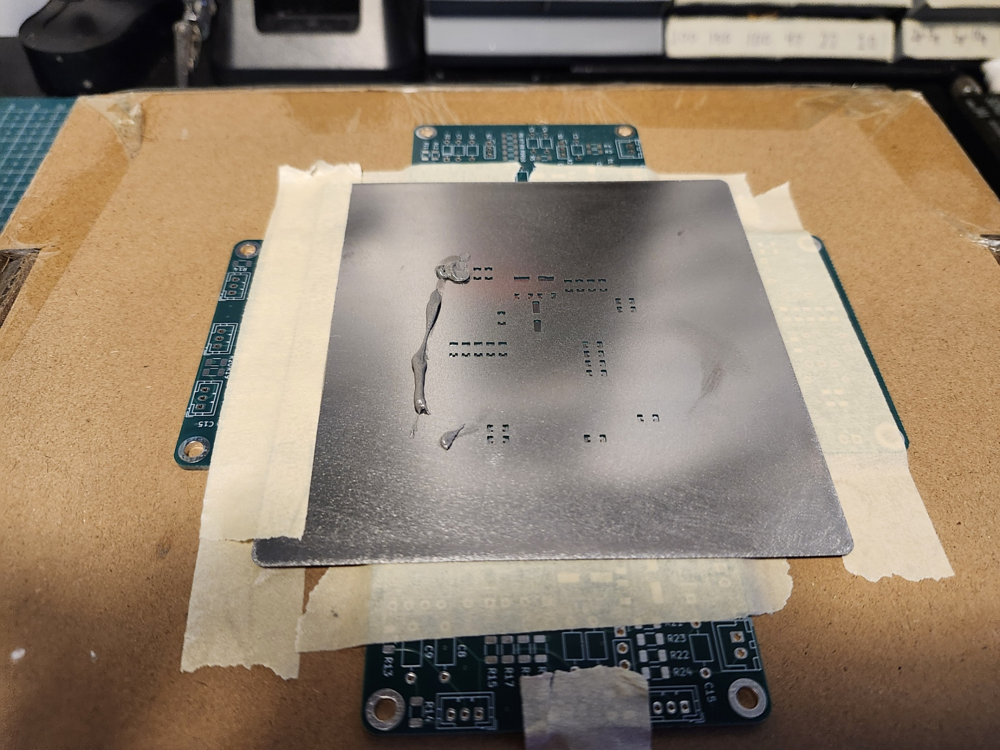
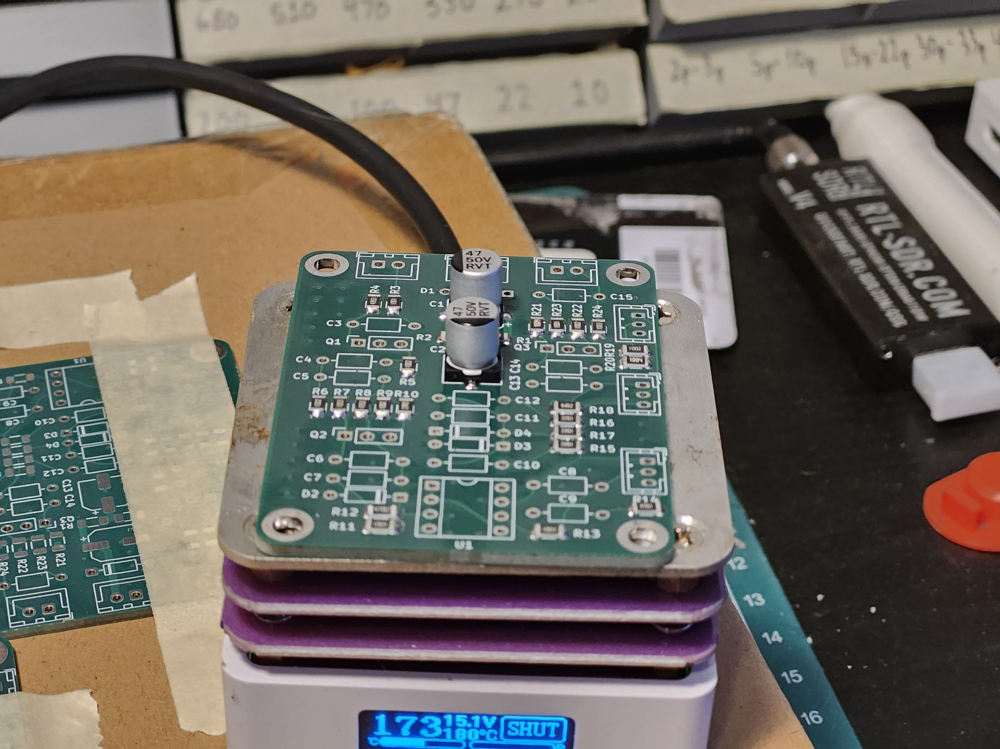
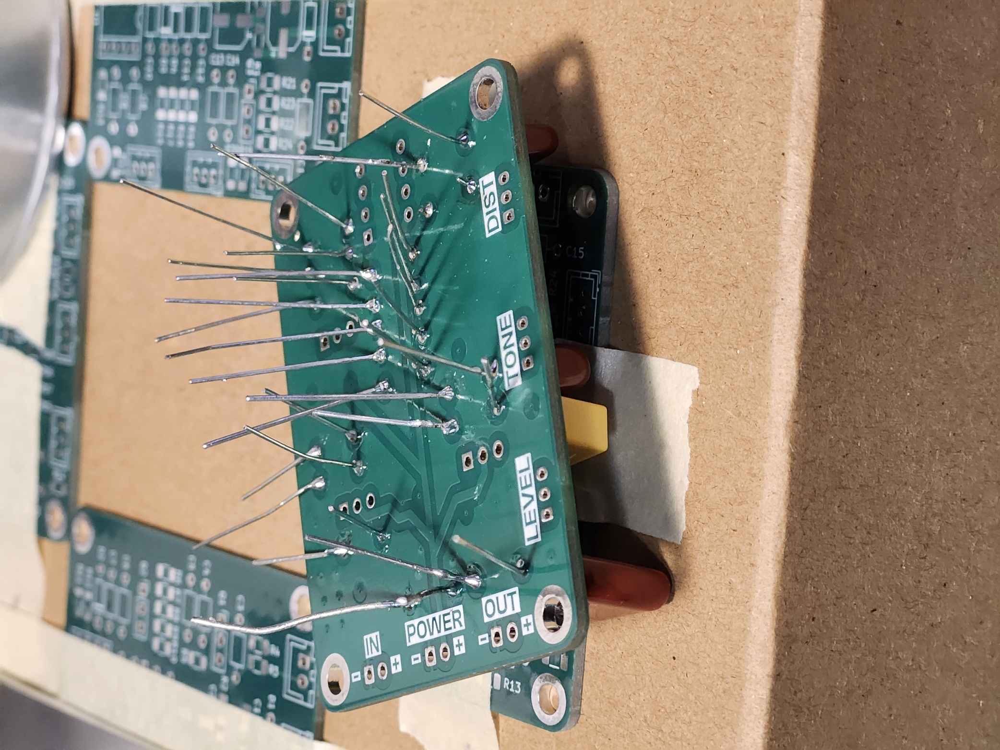
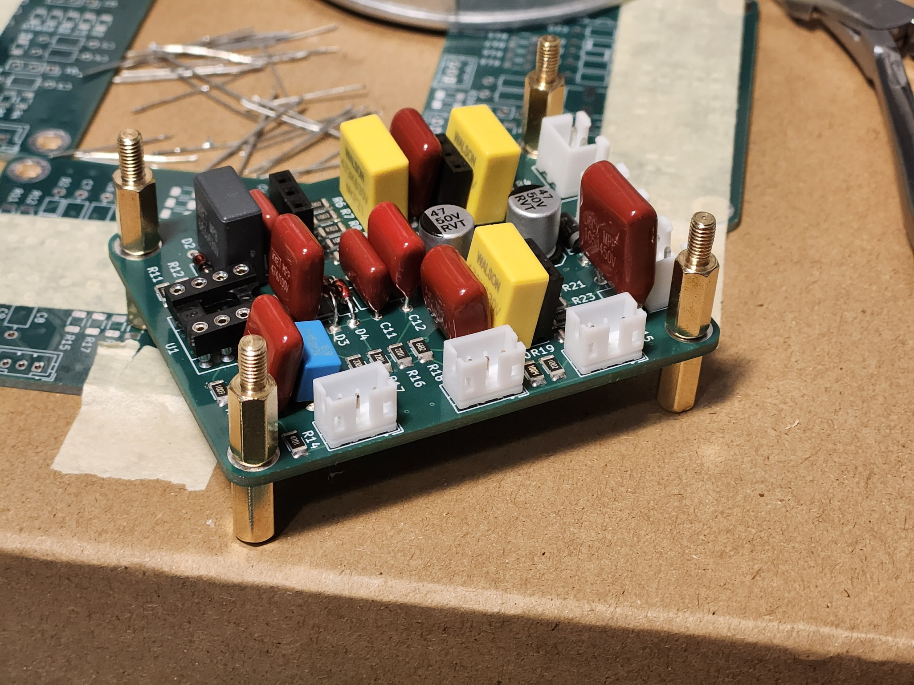
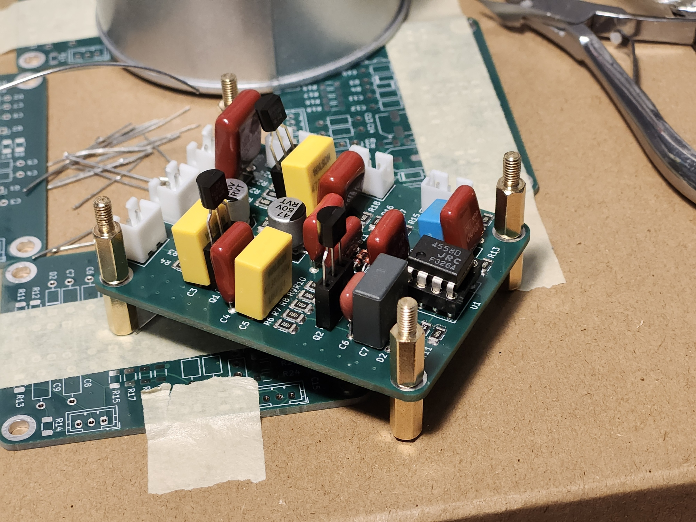

# Distortion Pedal

## 27 December, 2025

I've had this idea of creating a super tiny . and putting it inside my guitar but kept procrastinating and starting other projects; Today I made it my goal to finally start making some progress and possibly finish this project.

I wanted to make a DS-1 clone for this project (*The Boss DS-1 is arguably the most iconic distortion pedal*); to start off I went over to my favorite website for DIY pedals - [ElectroSmash](https://www.electrosmash.com/) , they have really nice detailed circuit breakdown for the DS-1 which I referred to for this project.

I spent a couple minutes copying the schematics down and finally ended up with this in kicad (I added some mounting holes too; you'll find out why later)

While In the schematic header I also fixed something really important. You see the 2SC2240 has a BCE pinout and not the common CBE pinout, so I fixed it up in the symbol editor for now.

After doing this I moved onto assigning footprints. This was a really time consuming process and kinda annoying for me. I wanted to use film capacitors so I went with a 7.5mm pitch footprint for most capacitors and went with smd aluminium capacitors for the power capacitors. For resistors I went with 1206 just because I wanted them to be tiny but still easily hand solderable; I spent quite literally 10 minutes trying to figure out the JST names but in the end kinda understood them, I used JST XH and PH connectors for the potentiometers and power/input/output. The reason I went with JST connectors instead of just you know adding holes and soldering to them is because these usually cause more problems down the road, if I ever wanted to take the board out and replace something, I'd have to carefully pull it out risking breaking the other connections; with connectors it's just as easy as unplugging them, and JST connectors are more secure compared to something like standard dupont connectors; Lastly for my OP Amp IC, I chose to use a socket instead of a standard DIP-8 footprint; reason being that I wanted to later swap it out and experiment with other parts, I did the same thing for the transistors; I added some female pin sockets which I could just use to quickly swap them out.

I moved onto the PCB after assigning most of the footprints. Now here layout was really crucial; you can't just randomly place parts anywhere as - a) that would cause issues routing b) even if you managed to route everything, there'd be a lot of noise.
Now since our circuit is basically amplifying our input signal; any noise also gets amplified meaning you have to be careful with our layout.
I probably spent more time on perfecting the layout than making the schematic and routing combined. here are some pictures of my progress-

*Assigned Net Classes*

I may actually have OCD when it comes to PCBs; I basically need to align everything and distribute stuff evenly and I spent a TON of time making sure the board was pretty; and I'm glad I spent that long just laying out components as this made routing dirt easy for me.

I decided to upgrade my board to 4 layer as I wanted it to have a solid reference plane. I routed all my audio signals on top layer, with a solid ground reference right under it; on inner2 I routed out the bias and poured ground; then on the back layer it was just 9v and ground pour; to finally wrap it all up I added stitching vias on the board. And of course added some silkscreen labels on the back.

Now all that was left to do was assign LCSC number to the components; so uh yeah I probably spent about 30 minutes finding the right components (majority of this was spent on finding JST connectors :sob: ) ; I also had to find JST housing and crimp connectors which was so HARD cause I have no idea how they are named and lcsc search is not really the best; after just going through the listings on their page I finally found them, for housing they are called {Connector Type (xh,ph,sh etc)}P-{Number of pins}; as for the crimp connectors its S{Connector type}-Somerandomstuff

While I was in LCSC I also added some M3 10mm brass standoffs; I added the mounting holes just for these. So with the pedal, I can't just leave it floating inside the guitar right and I can't just stick it anywhere as there will be copper foiling inside the guitar walls (I'll get to this later); the standoffs come in handy here and give me the ability to mount the PCB securely.

And since I'm mounting the PCB inside the guitar I would need to actually need to cover the insides of the guitar with some copper tape and ground it to actually prevent the pedal from picking up noise from EMI. Now this here is a really important step because as I previously mentioned with a distortion pedal any noise that comes in will get amplified too and will just make the whole thing sound super bad; and I've personally experienced this, my first pedal had a 3D printed enclosure and it sounded horrible because of the hum and static, the way I solved that was to cover the insides with aluminum foil and then ground it; but you know eventually I just moved onto a solid aluminum enclosure (which was much better).

So anyway I just sourced a 50mm x 10M copper tape and a couple of pots from aliexpress for my project and then moved onto creating the actual BOM for the project and setting up the repository and everything.

### Time Spent: 6.5 Hours

## 3 March, 2026

It's been a while, I had been pretty busy with assembling and debugging my V3s board and Audio Dev board and this was kinda left in the shadows. But I decided to lock in and assemble the PCB today.

Started off by using Kicad's Interactive HTML BOM plugin to generate a BOM I could refer to while assembling.

I started off by using a stencil to apply solder paste to the board and then placing all the SMD componenets and then reflowing them.

After that I moved onto THT components and soldered all of them, and then cut off their leads with a scissor type tool (idk what its called lmao)

After assembling the board this is what it looked like

Looks pretty sick! unfortunately I didn't have enough time or energy to go ahead and crimp the JST connectors and then embed them inside my guitar, so that's gonna be a task for another weekend.

While here I notice that all my images also got cooked because I was using hack club CDN which broke and I used the api to use it so that meant I didn't even have any option to recover them. So I spent a few minutes just manually replacing the images with local images I had in my vault folder, I'm not certain that they are 100% accurate but most of them look fine.

### Time Spent: 3.5 Hours