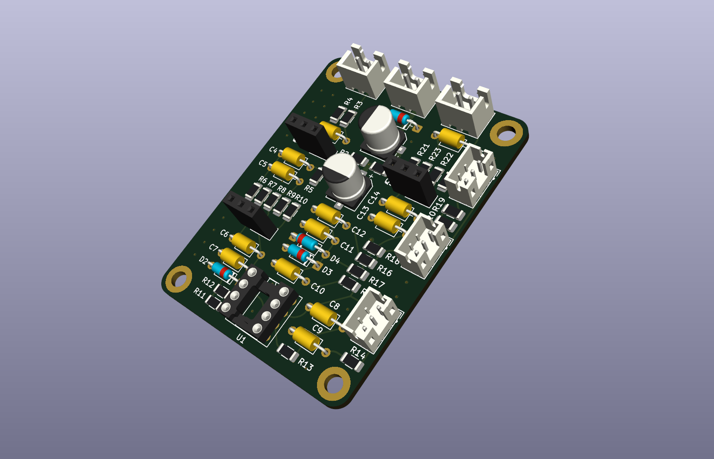
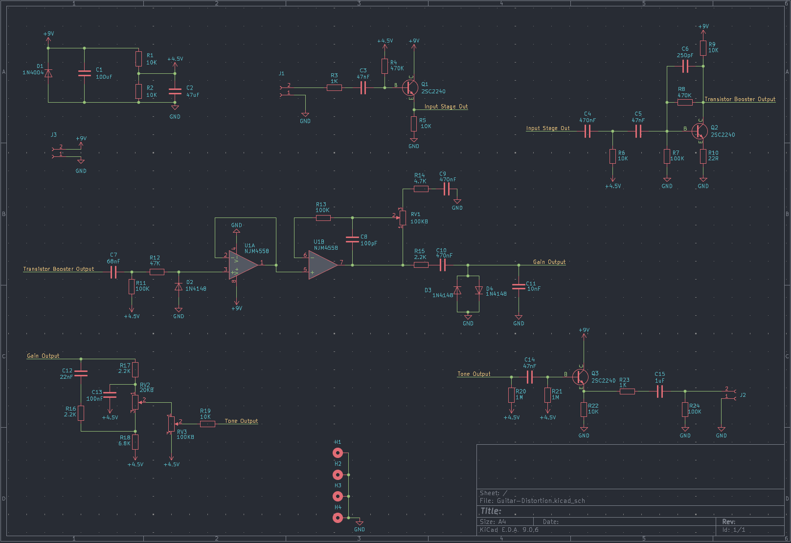
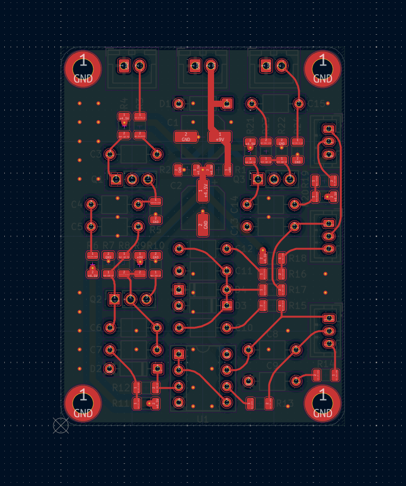

# Distortion Pedal

A tiny distortion pedal PCB designed to be embedded inside a guitar. The board uses 1206 and THT components making it easily moddable; in addition it also includes pin sockets for transistors and op amp making it easy to swap out and try different components for different sounds!

---

## Schematics

Schematics pdf is available under the `/PCB` folder and the project's KiCad files can be found under `/PCB/kicad`.

---

## PCB

---

## License

This project is licensed under the CERN Open Hardware Licence Version 2 Weakly Reciprocal [(CERN OHL W)](LICENSE.txt)

